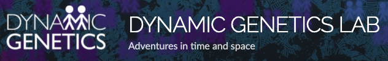

# Deep Learning for Data Science

Tutorials on Deep Learning for Data Science with

## Content at a glance

- **I**: **ANN and Automatic Differentiation**

  1. Intro to Artificial Neural Networks

  - Short intro: Supervised vs Unsupervied Learning
  - Perceptron: the linear Neuron model

    - Short on Vectorisation
    - ADAptive LInear NEuron (ADALINE)

  - Multi-Layer Perceptron

    - `numpy`-based implementation
    - `torch.Tensor`-based implementation

  - From ANN to DNN

    - Introduction to `torch.nn`
    - PyTorch Model Persistence
    - Classification and Regression Revisited
    - Short on Universal Approximation Theorem
    - from Logistic to Softmax
    - Multi-class Classification and `CrossEntropyLoss`

  2. Automatic Differentiation and `autograd`:

  - Intro to Automatic Differentiation

    - forwad mode AD
    - backward mode AD
    - `tangent` and `autograd`

  - Towards `torch.nn`: [`micrograd`](https://github.com/karpathy/micrograd)
    - `torch.Tensor` and `autograd`

- **II**: **Data and Dataset**

  3. Data for Machine and Deep Learning

  - Data _for_ Machine (Deep) Learning

    - `torchvision`
    - `torchtext`
    - `torchaudio`

  - Deep learning _for_ Data

    - Choose your Estimator
    - Choose your DL model

  - Data the `torch` way - Introducing `torch.utils.data`, `DataSet`, and `DataLoader`
    - Preparing Data for Experiments - _Training_, _Test_ and _Cross Validation_

### Requirements

This tutorial runs on **Python 3** (Py3.7+ should be fine), and requires the following main packages:

- `numpy`
- `scipy`
- `matplotlib`
- `scikit-learn`
- `pandas`
- `torch` (of course 😄)
- `torchvision`

The complete list of requirements is available in [`requirements.txt`](requirements.txt)

Detailed (_step-by-step_) instructions to setup the Python virtual environment on your local machine are also available [here](./setup.md).

### License Summary

The material provided in this repository adopts two different licence files, for Lecture notes and Source Code, respectively.

The Lecture notes (and corresponding source notebooks) are available under the **Creative Commons Attribution-ShareAlike 4.0 International License**.

The samples and reference code within this repository is made available under the **Apache License 2.0**. See the `LICENSE` file.

### References

**Author**: Valerio Maggio, **Senior Research Associate** `@` Dynamic Genetics Lab

| Contact                                                                                                                                |
| -------------------------------------------------------------------------------------------------------------------------------------- |
|  [`@leriomaggio`](http://twitter.com/leriomaggio)             |
|  [`ValerioMaggio`](http://it.linkedin.com/in/valeriomaggio) |
|  [`valerio.maggio@bristol.ac.uk`]()                                |
